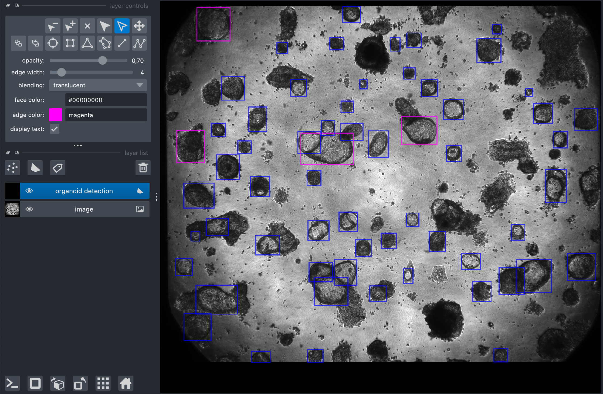

# Colorectal Cancer Organoids Detection


<p align="center">
  
</p>

This repository is a Napari based tool that allows to annotate organoids in brightfield microscopy images with bounding boxes. To make the annotation process fastest we implemented an AI-assisted labelling system which uses the predictions of [GOAT](https://github.com/msknorr/goat-public) as a baseline, lets the annotator correct them as needed, and stores the corrected annotations.
The program requires in input only the path to the dataset folder containing the images to annotate. This dataset is required to have a specific structure: the images need to be stored in a subfolder named `images`, while the annotations will be stored in a separate subfolder named `annotations`. The images can be stored in a structured manner separating for example images coming form different patients and/or different treatments, this structured will be automatically replicated in the `annotations` folder.

```
├── dataset name
            ├── images
                    ├── subfolder_1
                    ├── subfolder_2
                    ├── ...
            ├── annotations
                    ├── subfolder_1
                    ├── subfolder_2
                    ├── ...
                
```

The annotation tool has two usage modes:
- in **annotation** mode the program will keep track of the images that have been annotated, and every time the program is stopped and started again it will restart where the user left off during the last session.
- in **review** mode the tool allows to review the images already annotated and to apply further corrections if necessary.

In addition, this  framework has been developed to annotate fibroblasts on the images. However, in this case the annotation consists in points centered in the nuclei of the fibroblast and there is no model that predicts a baseline for the annotations.

## Installation

1. Clone the repository on your local machine.
    ```shell
    git clone https://github.com/HelmholtzAI-Consultants-Munich/Colorectal-Cancer-Organoids-Detection.git
    ```
2. Install miniconda on you machine, you can find the official installation instructions [here](https://docs.anaconda.com/miniconda/miniconda-install/).
3. Create a new conda environment:
    ```shell
    conda create -n orga python=3.12
    ``` 
4. Activate the newly created environment
    ```shell
    conda activate orga
    ``` 
5. Navigate to the project directory in your terminal.
6. Install the required dependencies by running in you terminal the folling command:
    ```shell
    pip install -e .
    ```

7. Download the GOAT weights from [here](https://drive.google.com/file/d/1AcrYCBR5-kg91C61boj221t1X_SVX8Hv/view) and save them in the `model` folder without renaming it.

## Usage Instructions

To use the tool, first thing open the terminal and activate the conda environment (`conda activate orga`). The package contains different tools that can be used to perform the following functions:

1. Annotate a given dataset of images.
2. Merge the annotations generated by two different annotators.
3. Correct the merged annotation.

Next, we describe in details what these tools do and how to use them, for more detailed information regarding the usage you can always refer to their help function:
```shell
<command_name> --help
```

### Image Annotation

Given a dataset of microscopy images, these tools allow to annotate them with the aid of a GUI based on Napari. The user can generate bounding box annotations of the organoids and point annotations for the fibroblasts. When annotation organoids each image will be presented to the user with the predictions made by GOAT, which can be used as a baseline for the annotation. For clarity the baseline boxes are colored in $\color{blue}{\textbf{blue}}$ , while the bpoxes manually added by the user are represented in $\color{magenta}{\textbf{magenta}}$ .

1. **Annotate:** 

    To run the annotation pipeline write the following command in the terminal and replace `dataset_path` with the actual path on you machine. For annotating organoids run:
    ```shell
    annotate_organoids -d dataset_path -a
    ```
    while for annotating fibrobalsts run:
    ```shell
    annotate_fibroblasts -d dataset_path -a
    ```
    During the execution type:
    - "**h** to hide or view the current annotations
    - "**s**" to save the annotation and go to the next image:
    - "**e**" to end the program.

2. **Review**:

    To review the images previously annotated the commands are similar to above, for organoids annotations run:
    ```shell
    annotate_organoids -d dataset_path -r
    ```
    and for fibroblasts annotations run:
    ```shell
    annotate_fibroblasts -d dataset_path -r
    ```

    As before, during the execution type "**s**" to save the annotation and go to the next image, and type "**e**" to end the program.

### Merging Multiple Annotations

If two different annotators independently annotated the same dataset it is possible to merge the two annotations. The tool uses the Hungarian algorithm to match boxes form the two annotators that have maximal intersection over Union (IoU) score nad merges the "matching" boxes by averaging the edges. In addition, it is possible to set a minimum threshold for the IoU score below which two boxes are not matched by the algorithm (```-iou``` parameter, defailt value is 0.5). Finally, the user can decide whether to include or to discard the unmatched bounding boxes in the final annotation with ```--keep``` or ```--drop``` flags (default ```--keep```).

To run the tool write one of the following command in the terminal depending if you want to keep or discard unmatched boxes, and replace the dataset paths and the iou threshold with the desired ones:
- **keep** the unmatched boxes: ```merge_annotations -d1 annotator_1_dataset_path -d2 annotator_1_dataset_path -o output_dataset_path --keep```
- **discard** the unmatched boxes: ```merge_annotations -d1 annotator_1_dataset_path -d2 annotator_1_dataset_path -o output_dataset_path  --drop```

**Remark**: this tool does not support fibroblasts annotations

### Correct Merged Annotations

After the annotations have been merged, it is posible to undergo a second round to further manually correct the annotations. This tool allows to navigate the dataset generated with ```merge_annotations``` and perform the necessary manual corrections and consists in a GUI based on Napari. Similar to above, the boxes are colored to increase the clarity: the matched boxes are represented in $\color{green}{\textbf{green}}$ , the unmatched boxed are represented in $\color{red}{\textbf{red}}$, and the new manually added boxes in $\color{magenta}{\textbf{magenta}}$.

To run this tool write the following command in the terminal:

```shell
correct_organoids -d dataset_path
```

As described above for the annotation tool the same keyboard shortcuts are unavailable, and to review the previously annotated images just add the ```-r``` flag to the terminal command.

**Remark**: this tool does not support fibroblasts annotations

### Genrate Masks

From the annotated bounding boxes, we can use the instannce segmentation model to generate the segmantion masks for each detection in the annotation.  

```shell
create_masks -d dataset_path -o dataset/output_dataset_path
```

### Inference

TODO

## Contributing

Contributions are welcome! Please follow these steps:

1. Fork the repository.
2. Create a new branch.
3. Make your changes.
4. Submit a pull request.

## License

This project is licensed under the MIT License.
